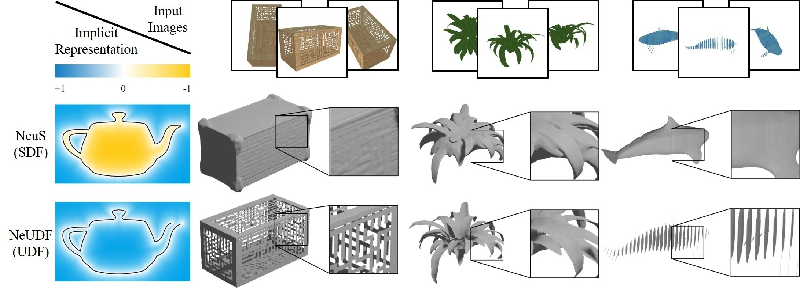

# Baseline:NeUDF


## [Project page](http://geometrylearning.com/neudf/) |  [Paper](http://geometrylearning.com/neudf/paper.pdf)
## Usage
### Setup environment
Installing the requirements using:
```shell
pip install -r requirements.txt
```

To compile [MeshUDF](https://github.com/cvlab-epfl/MeshUDF) to extract open mesh from the learned UDF field, please run:
```shell
cd custom_mc
python setup.py build_ext --inplace
cd ..
```

To use [PyMeshLab](https://github.com/cnr-isti-vclab/PyMeshLab) and a customized Screened poisson to extract open mesh from the learned UDF field, please run:
```shell
pip install pymeshlab
```
To build PyMeshLab from source, please refer to [PyMeshLab](https://github.com/cnr-isti-vclab/PyMeshLab).

about tinycudann:
```
git clone --recursive https://github.com/nvlabs/tiny-cuda-nn
## with a Nvidia GPU,gcc 8+,cmake 3.21+ 
cd bindings/torch
python setup.py install
## it will take a little long time to compile and install(20-30min)
```


### Running

- **Train without mask**

```shell
python exp_runner.py --mode train --conf ./confs/womask_open.conf --case <case_name>
```

- **Train with mask**

```shell
python exp_runner.py --mode train --conf ./confs/wmask_open.conf --case <case_name>
```

- **Extract surface using MeshUDF** 

```shell
python exp_runner.py --mode validate_mesh_udf --conf <config_file> --case <case_name> --is_continue
```

The corresponding mesh can be found in `exp/<case_name>/<exp_name>/meshes/mu<iter_steps>.ply`.

- **Extract surface using Screened Poisson** 

```shell
python exp_runner.py --mode validate_mesh_spsr --conf <config_file> --case <case_name> --is_continue
```

The corresponding mesh can be found in `exp/<case_name>/<exp_name>/meshes/spsr<iter_steps>.ply`.

- **Extract surface using MarchingCubes** 

```shell
python exp_runner.py --mode validate_mesh --conf <config_file> --case <case_name> --is_continue
```

The corresponding mesh can be found in `exp/<case_name>/<exp_name>/meshes/<iter_steps>.ply`.

#### all of the params can be found at the bottom of exp_runner.py , any further train/test settings are in the conf file.

### Datasets and results

You can download the full datasets and results [here](https://drive.google.com/drive/folders/1g2x5v6QWUdjQkNoszL2d68I2Gp0VRj5E?usp=sharing) and put them in ./public_data/ and ./exp/, respectively.

The data is organized as follows:

```
public_data
|-- <case_name>
    |-- cameras_xxx.npz
    |-- image
        |-- 000.png
        |-- 001.png
        ...
    |-- mask
        |-- 000.png
        |-- 001.png
        ...
exp
|-- <case_name>
    |-- <conf_name>
        |-- checkpoints
            |-- ckpt_400000.pth
```

### Train NeUDF with custom data

Please refer to the  [Data Conversion](https://github.com/Totoro97/NeuS/tree/main/preprocess_custom_data) in NeuS.


